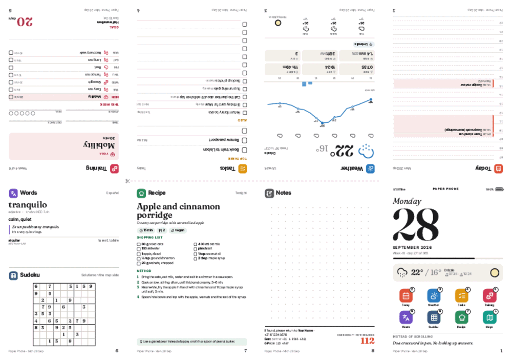
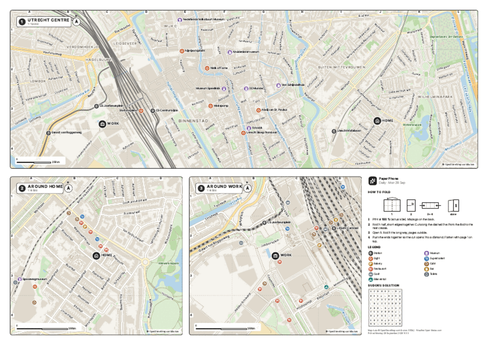
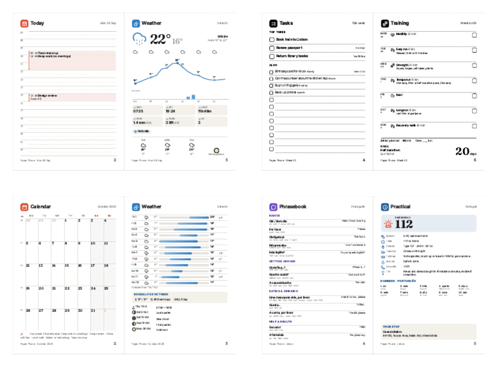

# paper-phone

Print your phone on one sheet of paper. `paper-phone` builds a PDF that folds into an eight-page pocket booklet: agenda, weather, tasks, training plan, words to learn, a recipe, notes. When you unfold it, the back of the sheet is a set of street maps. It is a Python take on Google's [Paper Phone](https://experiments.withgoogle.com/paper-phone) experiment ([code](https://github.com/specialprojects-experiments/paperphone)), rebuilt as a command-line tool with more pages and real maps.




There are four editions, each in colour and in a separate black-and-white design:

| Edition | Pages 1 to 8 | Maps on the back |
| --- | --- | --- |
| `daily` | cover, today's timeline, hourly weather, tasks, today's workout, word of the day + sudoku, recipe, notes | city centre, around home, around work |
| `weekly` | cover, week at a glance, 7-day weather, tasks, training week, recipe, words + offline ideas, habit tracker | same |
| `monthly` | cover, month calendar, 2-week forecast + climate normals, goals and tasks, training month, 14 words, recipe, 31-day habit tracker | same |
| `travel` | cover, itinerary, trip weather, phrasebook, practical info (emergency number, money, plugs, tipping, numbers), packing list, places, expenses | trip overview fitted to your places, around your stay, one more area |



## Quick start

You need [uv](https://docs.astral.sh/uv/) and Google Chrome. Chrome does the PDF printing through Playwright. Without Chrome, run `uv run playwright install chromium` once.

```bash
uv sync
mkdir my-phone && cd my-phone
uv run --project .. paper-phone init          # writes paperphone.yaml, tasks.md, calendar.ics
# edit paperphone.yaml: your address, calendar link, training plan, trip
uv run --project .. paper-phone build daily   # or weekly, monthly, travel
uv run --project .. paper-phone all           # every edition
```

Each build writes three files per mode to `./output`:

- `paper-phone_daily_2026-09-28_color.pdf` is the one to print. Page 1 is the booklet side, page 2 the maps.
- `…_booklet.pdf` shows the pages in reading order, as spreads. Use it to check the content on screen.
- `….png` is a quick preview of the printed sheet.

Useful options: `--date 2026-10-01`, `--mode color|bw|both`, `--paper a4|letter`, `--back maps|poster|blank`, `--offline` (cached data only), `--no-maps`. Run `paper-phone build --help` for the full list.

## Printing and folding

Print at 100 % (actual size), not "fit to page". Print double-sided to get the maps, flipping on either edge: the map side is only read fully unfolded, so its orientation relative to the booklet does not matter. For a single-sided print, use `--back blank` or print page 1 only.

```
   +-----+-----+-----+-----+
   |  5  |  4  |  3  |  2  |   top row prints upside down
   +-----+- - -+- - -+-----+   <- cut the middle half of this line
   |  6  |  7  |  8  |  1  |
   +-----+-----+-----+-----+
```

1. Fold the sheet in half, short edges together, print outside. Crease well.
2. Starting at the fold, cut along the middle line up to the next crease. The sheet has a dashed line and a scissors mark there.
3. Open the sheet and fold it in half the long way, print outside.
4. Push both ends towards the middle. The cut opens into a diamond. Keep pushing until the four wings meet, then flatten them with page 1 on top.

`paper-phone fold` prints the same instructions, and the map side has a small diagram.

Every page keeps at least 5 mm from the sheet edge, so printers with a 4 to 5 mm dead zone lose nothing. The maps on the back sit above and below the cut, never across it. `--back poster` prints one big city map instead, and the cut will run through its middle.

## Configuration

Everything lives in `paperphone.yaml`. `paper-phone init` writes a commented example. The main parts:

```yaml
home: {query: "Oudwijk, Utrecht, Netherlands"}   # any address or place OpenStreetMap knows
work: {query: "Jaarbeursplein, Utrecht"}
language: {learn: es, native: en}                  # words: es fr it de pt ja; translations: en or nl
calendars: [calendar.ics, "https://calendar.google.com/…/basic.ics"]
tasks_file: tasks.md                               # - [ ] Renew passport due:2026-10-02 ! #admin
habits: ["Phone-free morning", "Move 30 min"]
training:
  start: 2026-09-07                                # Monday of plan week 1
  goal: {name: "Half marathon", date: 2026-10-18}
  plan:
    - {tue: {title: "Easy run", distance_km: 6}, thu: {title: "Intervals", distance_km: 8, detail: "6 × 800 m"}}
trip:
  destination: "Lisbon, Portugal"
  start: 2026-10-12
  end: 2026-10-16
  stay: {name: "Casa do Bairro", query: "Rua da Rosa 100, Lisboa"}
  places: [{name: "Castelo de São Jorge", query: "Castelo de São Jorge, Lisboa"}]
```

A Google Calendar works through its "secret address in iCal format". Recurring events are expanded. In the monthly calendar, events that repeat three or more times move to a one-line summary under the grid, so the day cells keep room to write.

Without a `training:` section the training page shows a gentle all-round week (two bodyweight circuits, walks, one easy run, mobility). Without tasks, the task page is an empty checklist.

### Choosing pages

Each edition takes exactly eight pages. A pair in brackets shares a page:

```yaml
pages:
  daily: [cover, agenda, weather, tasks, training, [words, sudoku], recipe, notes]
```

Modules: `cover agenda week calendar itinerary weather tasks training words phrases recipe notes habits expenses packing practical places nearby sudoku prompts`. The ones that fit on half a page are `tasks words notes nearby sudoku prompts`.

Maps can be overridden too:

```yaml
maps:
  - {title: "Utrecht centre", place: city, scale: 12000}
  - {title: "Around home", place: home, scale: 6500}
  - {title: "The station", place: {query: "Utrecht Centraal"}, scale: 5000}
```

`place` is `home`, `work`, `stay`, `city`, `fit` (fits every marker, used for trips) or an address.

## Where the data comes from

| What | Source | Cached for |
| --- | --- | --- |
| Addresses | OpenStreetMap Nominatim | forever |
| Map data | OpenStreetMap via Overpass | 30 days |
| Forecast, sunrise, sunset | Open-Meteo | 3 hours |
| Climate normals (10-year average) | Open-Meteo archive | 90 days |
| Exchange rates | ECB via Frankfurter, fallback open.er-api.com | 12 hours |
| Public holidays | `holidays` package | offline |
| Moon phases | Meeus' algorithm, computed locally | offline |
| Words, phrasebooks, recipes, prompts, country facts | bundled in `src/paper_phone/content/` | offline |

The cache lives in `~/.cache/paper-phone` (set `PAPER_PHONE_CACHE_DIR` to move it). With `--offline` nothing goes over the network, and pages without data print a blank to fill in by hand. The forecast reaches 16 days ahead. For trip days beyond that, the weather page shows grey "typical" rows from the 10-year average, and it tells you to print again closer to the date.

Maps are not tiles. The tool downloads the raw OpenStreetMap features and draws its own vector map in millimetres, so street names stay sharp at 5 pt. That also makes a real black-and-white style possible: water is hatched, parks are dotted, and road weight carries the hierarchy. It is not a grey copy of the colour map. Street names follow the streets and avoid colliding with each other. Map data © OpenStreetMap contributors, ODbL. The attribution is printed on every map.

Bundled content: 100 words each in Spanish, French, Italian, German, European Portuguese and Japanese, all with English and Dutch translations. Phrasebooks cover es, fr, it, de, pt, ja, el, hr, cs and tr. There are 28 seasonal recipes, 160 offline prompts and practical facts for 50 countries. Add your own recipes with `recipes: {extra_file: my-recipes.yaml}` in the same format as `content/recipes.yaml`.

## How it works

```
config.yaml ─> build.gather()      geocode, forecast, calendars, tasks, map data
            ─> modules/*.py        one function per page, returns a template context
            ─> templates/*.j2      HTML per page, positioned and rotated by imposition.py
            ─> Chrome (Playwright) PDF, all vector
```

`imposition.py` holds the fold. A test checks the layout physically: after the cut, the panels that still share paper must form one ring in reading order, 1 → 2 → … → 8 → 1.

One print quirk shaped the code. Chrome rasterises SVG `<pattern>` fills at screen resolution when it prints to PDF. So dot grids, ruled lines and checkbox rows are drawn at print time by `templates/fill.js`, which fits whole rows into each box. The map textures are dashed strokes inside clip paths. Everything in the PDF stays vector.

## Development

```bash
uv run pytest        # 31 tests, no network needed
uv run ruff check . && uv run ruff format --check .
uv run ty check
uv run pre-commit install
```

## Limitations

- Right-to-left scripts and vertical Japanese are not handled. Japanese words print horizontally with romaji.
- Coastlines work when OpenStreetMap delivers a closed coastline around the map area. On very large maps an unclosed coastline leaves the sea blank.
- Overpass can be slow or busy. The client tries three mirrors, and a failed map leaves the other pages intact.
